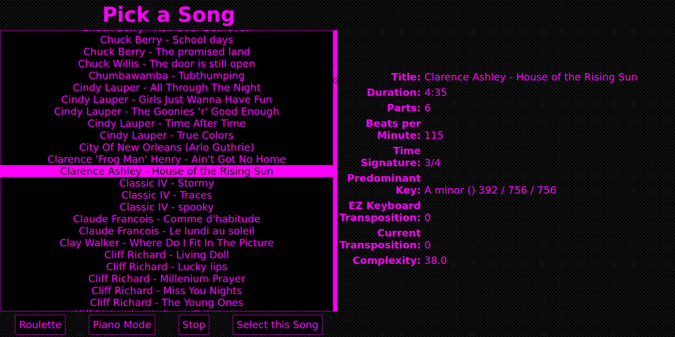
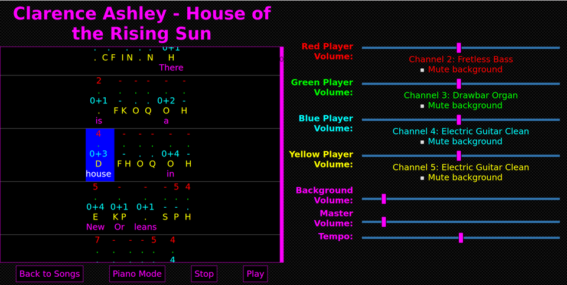
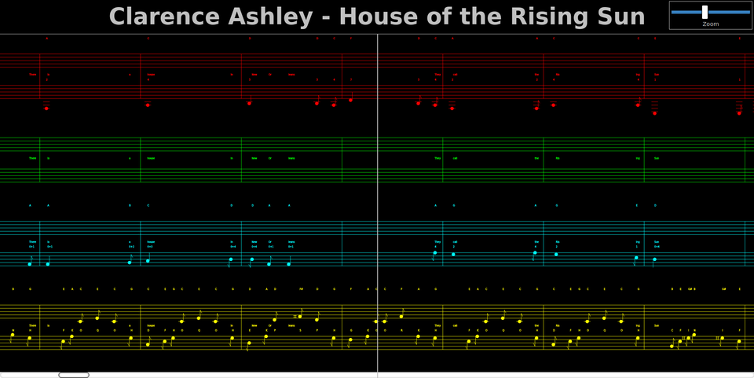
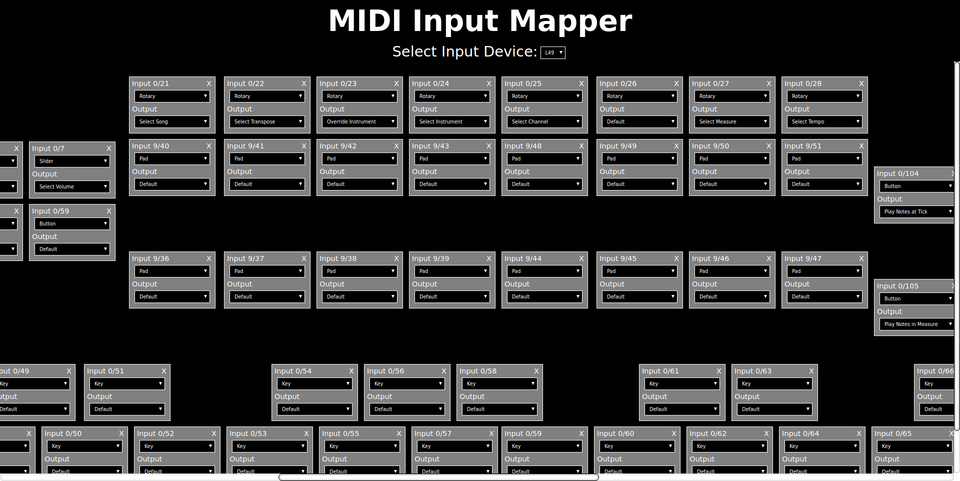
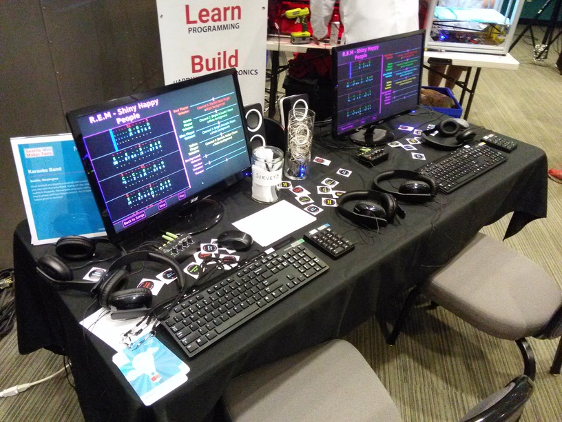

# Overview

Welcome to Karaoke Band, an experiment in music composition and performance. With Karaoke Band, you can have fun playing along with familiar songs while learning how they are constructed from a number of parts. You’ll hear how the arrangement and timing of notes in those parts affects the overall sound and even have a chance to improvise, if you want.

Karaoke Band uses ordinary MIDI files as its source of music. MIDI files contain a collection of messages. Two of the most common messages are Note On and Note Off, which correspond to pressing and releasing a key on a MIDI keyboard. These messages include the velocity at which they key was pressed, the relative timing, and the channel number, which is generally a grouping of notes for an individual instrument.

Karaoke Band reads the messages in the MIDI file and constructs an internal model of the song.  It then lets you select a channel and maps the sounds (notes, chords, drums) in the channel to keys on a regular PC keyboard or numeric keypad. The sounds in the song are mapped to the keys on the keyboard from low (A or 0) to high (Z or 9). If there are more sounds than keys, the additional sounds are mapped to combinations of keys, such as Shift+G.

Only the sounds in the key of the song are available on the keyboard. This makes it easier to play by reducing the total number of keys required and lets you improvise your own parts using sounds that fit the underlying harmonic structure of the song.

Karaoke Band is a web application. The server is written in Java with a little bit of C for low level interfaces. The client is written in JavaScript, HTML and CSS. In addition to reading MIDI files and generating an internal model of the song, the server captures the keyboard input from the attached devices and converts it to the sound of the notes or drum beats.

The browser-based client user interface opens a WebSocket connection to the server and uses it to send commands and receive HTML to render in the browser. There are two variations of the client. One features a colorful, karaoke-style prompter that uses nested HTML DIVs to structure the interface. The other features a more traditional staff-like approach that uses Scalable Vector Graphics (SVG).

Karaoke Band includes support for MIDI controllers such as keyboards and drum pads. These devices generate MIDI messages when you press, rotate, or slide an input on the MIDI controller. Although many of these messages have predefined functions (like playing middle C when you press the white key in the middle of the keyboard), many of them do not, and so Karaoke Band includes a MIDI input mapper where you can define the action associated with each control.

Karaoke Band was developed for Linux and will run on a Raspberry Pi Model 3. You can build Karaoke Band from the source code in this repository, or download a precompiled Raspberry Pi version from the releases tab.

# Installation

Karaoke Band uses FluidSynth to convert the MIDI notes into sound. To install FluidSynth on a Raspberry Pi, open a shell window and enter the following command:

```
sudo apt-get install libfluidsynth-dev fluid-soundfont-gm
```

After you've installed FluidSynth, download the release zip file from github and unpack it in the pi home directory to create a folder called MusicPad.

Karaoke Band uses either regular MIDI files or MIDI karaoke files. MIDI Karaoke files are MIDI files with song lyrics. They usually end with a .kar suffix. Use Google to search for midi karaoke files. Download some to:

```
/home/pi/MusicPad/midi
```

# Startup

Karaoke Band is designed to be used with multiple USB computer keyboards, with each player having their own keyboard, and an extra keyboard to control the system.

When Karaoke Band attaches a keyboard, it prevents that keyboard from being used for other purposes (like typing in a browser or shell window).

You can detach a keyboard from Karaoke Band by pressing NumLock+Esc. This makes it available for other uses. You can reattach it to Karaoke Band later by unplugging it and plugging it back in.

If you want to try Karaoke Band and you have only one keyboard, you'll have to get creative in your use of NumLock+Esc to detach the keyboard and then later unplug it and plug it back in to reattach it.

To start Karaoke Band, run shell script /home/pi/MusicPad/MusicPad.bash. Karaoke Band prints out some diagnostic information and connects your attached keyboards and MIDI controllers.

Next, open a current release of a modern browser, such as Chrome, and connect to Karaoke band:

```
http://localhost:8080/Karaoke.html
```

Add a bookmark for this page to make it easy to connect to in the future.

**Note:** Karaoke Band works with both standard alphanumeric PC keyboards (e.g. QWERTY keyboards) as well as numeric keypads. Press NumLock+/ (NumLock and slash together) to generate karaoke mappings for a numeric keypad and NumLock+* (NumLock and asterisk together) to generate karaoke mappings for a full sized alphanumeric keypad.

# Pick a Song

The first screen displays the MIDI karaoke files you downloaded to /home/pi/MusicPad/midi. When you click on a song, it plays the song and displays some information about the song. Click Roulette to randomly select a song. Click `Piano Mode` to play all parts using the Acoustic Grand Piano. Click `Stop` to stop playing the song. Click `Select this Song` to move on to the next screen.



# Pick your Part

The next screen displays all the parts in the song and lets each player select their part. When you click on a part, it plays that part and displays some information about the part. Click `Back to Songs` to return to the previous screen, `Stop` to stop playing the part, or `Select this Part` to move on to the next part or to start playing the song. In this screen shot, the Red, Green and Blue players have already selected parts and it's the Yellow Player's turn.


# Karaoke Prompter

The next screen displays each of the selected parts on the left, and important controls on the right. Press `Play` to play the song. As the music plays, the karaoke prompter scrolls to highlight the current position and tells you what key to press and how long to hold it.

You can use the controls on this page to set the player volume, background volume, master volume and tempo. **Hint:** Slide the tempo control to the left to make the song easier to play when you're just getting started.



# Staff Prompter

The Staff Prompter works with the Karaoke Prompter to display the music in familiar staff notation. Open a new browser window or tab and enter the following URL:

```
http://localhost:8080/Staff.html
```

Use the zoom slider to control how much of the music you see at once.



# MIDI Input Mapper

The MIDI Input Mapper lets you define the actions associated with the sliders, rotary controls and buttons on a MIDI controller. Open a new browser window or tab and enter the following URL:

```
http://localhost:8080/Mapper.html
```

To configure your MIDI controller:

1. Select a MIDI input device from the drop down. The drop down will be empty if Karaoke Band did not detect any MIDI controllers.
2. Press, rotate or slide an input on your MIDI controller to create a mapping.
3. Use the mouse to drag the new mapping to its correct position relative to other mappings.
4. Configure the mapping by selecting an action from the output drop down list.

If your MIDI controller contains pads, you can configure them for Karaoke Band by choosing Select Group or Select Sound from the output drop down list. The mapping will expand to include an index and a label. Use Group to define a group of sounds (like the SHIFT key on a PC keyboard) and Sound to define an individual sound (like the A key on a PC keyboard) The index should be unique across all groups and sounds. The label is what will be displayed in the Karaoke Prompter.



# Keyboard Shortcuts

Karaoke Band supports a number of commands that are available via the user interface, the MIDI Input Mapper or as keyboard shortcuts.

Commands that are available as keyboard shortcuts include:

Press NumLock + | For Command
----------------|------------
0 | Decrease Tempo
1 | Increase Tempo
2 | Decrease Background Volume
3 | Increase Background Volume
4 | Decrease Current Player Volume
5 | Increase Current Player Volume
6 | Select Previous Channel in Song
7 | Select Next Channel in Song
8 | Select Previous Instrument
9 | Select Next Instrument
/ | Enter Numeric Keypad Mode
* | Enter Alpha Keyboard Mode
- | Enter Measure Arpeggiator Mode
+ | Leave Measure Arpeggiator Mode
P | Play / Resume
S | Stop / Pause
I | Increase Master Volume
D | Decrease Master Volume
B | Backward
F | Forward

Escape | Disconnect Keyboard
Backspace | Reset Everything

# 2017 Seattle Mini Maker Faire

Hundreds of visitors got a chance to play with Karaoke Band at the 2017 Seattle Mini Maker Faire.

https://seattle.makerfaire.com/maker/entry/81/

The demonstration consisted of:

* 2 Raspberry Pi Model 3s
* 2 Acer 22 inch monitors
* 3 Alphanumeric PC keyboards
* 2 Numeric PC keypads
* 2 Standard PC mice
* 2 Amplified PC speakers
* 1 DROK TDA7377 Digital Audio Power Amplifier
* 2 Kenwood KFC-69655 6x9 inch 3-Way 400W speakers
* 2 Atrend 6x9 Speaker Boxes
* 5 Headphones (Sennheiser HD 202 II Professional)
* 2 4-channel Behringer Microamp HA400 headphone amplifiers
* 1 Belkin wireless router

One of the Raspberry Pi's ran the Karaoke Band software and a recent version of the Chrome browser. The other Raspberry Pi ran a Chrome browser connected to the Karaoke Band server.

In addition, the demonstration included an LED lighting controller that demonstrates the use of Internet of Things (IoT) technologies to light strings of colored LEDs in response to keyboard key presses. The controller includes an ESP8266 microcontroller as well as transistors and resistors, all soldered on a printed circuit breadboard.  The ESP8266 features integrated Wi-Fi, which allows it to connect to the network.

When you press or release keys on the keyboard, the server publishes messages to topics on a Message Queue Telemetry Transport (MQTT) server. The microcontroller firmware receives the messages and turns ESP8266 output ports on or off. These ports are connected via resistors to transistors and switch the transistors on or off. The transistors control the power to the LED strings. The result is that the LED strings go on or off each time you press or release a key.




